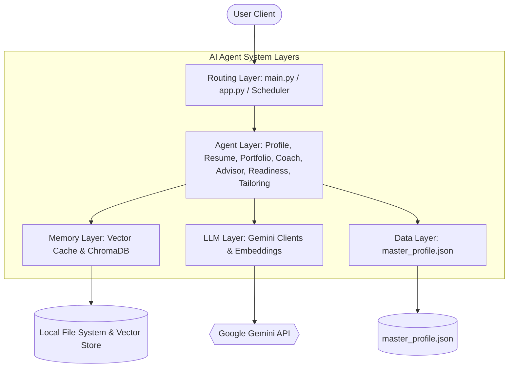

# AI Agent System Architecture Specification

This document provides a detailed breakdown of the architectural design, layers, data schemas, and information pipelines powering the **AI Career Assistant & Agent Architecture** project.

---

## 🏗️ 5-Layer Architecture Overview

The system is structured into five distinct, decoupled layers, ensuring modularity, clear separation of concerns, and ease of scaling.



### 1. Data Layer (Configuration & Ground Truth)
- **Primary Asset:** [`data/master_profile.json`](file:///d:/temp/ai-agent-roadmap/data/master_profile.json)
- **Role:** Serves as the single source of truth containing the candidate's personal data, education, skills, projects, and work experience.
- **Access Method:** Centralized through the [`tools/load_profile.py`](file:///d:/temp/ai-agent-roadmap/tools/load_profile.py) reader helper which handles UTF-8 encoding and folder resolution.

### 2. Memory Layer (Semantic & Session Persistence)
Provides both static search caching and stateful history preservation:
- **Vector Cache (`data/memory_index.json`):** Created by [`memory/manager.py`](file:///d:/temp/ai-agent-roadmap/memory/manager.py). Chunks the profile and generates/caches embedding vectors using MD5 hashing of the profile file to prevent redundant model calls.
- **Persistent DB (`memory/vector_db`):** Driven by [`memory/vector_store.py`](file:///d:/temp/ai-agent-roadmap/memory/vector_store.py). Employs **ChromaDB** to persistently store and query candidate mock interview logs (questions, responses, and recruiter critiques) categorized into specific collections (`interview_history`, `career_memory`, and `job_listings`).

### 3. Agent Layer (Modular Behavior Engines)
Decoupled agent files implementing distinct logic:
- **Profile Assistant (`agents/gemini_profile_agent.py`):** Chat agent retrieving context chunks from the profile index to answer candidate-specific queries.
- **Resume Generator (`agents/resume_agent.py`):** Uses strict formatting rules to output ATS-optimized resumes.
- **Portfolio Generator (`agents/portfolio_agent.py`):** Structured layouts focusing on business impact and highlights.
- **Interview Coach (`agents/interview_agent.py`):** Stateful agent managing mock Q&A, answer scoring, and feedback evaluation.
- **Career Advisor (`agents/career_advisor_agent.py`):** Coach agent performing meta-analysis on past interview database logs to generate weakness/strength analytics.
- **Application Readiness Agent (`agents/readiness_agent.py`):** Evaluates candidate profile compatibility against job descriptions to score fit percentage, list strengths, identify gaps, and output custom study roadmaps.
- **Resume Tailoring Agent (`agents/resume_tailor_agent.py`):** Dynamically alters profile summaries, bullet points, and skill orders to target specific job post demands (preserving truthfulness).

### 4. Routing Layer (CLI, Web UI, & Schedulers)
Coordinates launching and passing parameters to specific agents:
- **Terminal Entry (`main.py`):** Interactive terminal loop with exit handling.
- **Web UI Entry (`app.py`):** Streamlit web layout, stateful caching (`st.session_state`), and file exporter integration.
- **Daily Scrape Pipeline Scheduler (`app.py`):** Runs an in-memory background cron runner (`BackgroundScheduler` from `apscheduler`) checking and refreshing HN jobs at 8:00 AM every morning.

### 5. LLM Layer (AI Integrations & Vector Embeddings)
- **Client Configuration ([`tools/gemini_client.py`](file:///d:/temp/ai-agent-roadmap/tools/gemini_client.py)):** Instantiates and registers the `gemini-3.5-flash` model.
- **Embeddings Pipeline ([`tools/embeddings.py`](file:///d:/temp/ai-agent-roadmap/tools/embeddings.py)):** Calls `models/gemini-embedding-001` to generate vector representations (768 dimensions) and computes local Cosine Similarity.

---

## 🔄 Information Flow Pipelines

### Pipeline A: Profile Search (RAG Pipeline)
How a user question (e.g. *"What projects did he build?"*) gets resolved:

```
[User Question]
       ↓
[tools/embeddings.py] → Call Gemini API to embed question (task_type=retrieval_query)
       ↓
[memory/manager.py]   → Compute Cosine Similarity against all cached chunks in memory_index.json
       ↓
[Context Selection]   → Retrieve Top 3 segments (e.g. Project Showcase chunks)
       ↓
[LLM Generation]      → Prompt: "Answer question using ONLY this context: [Context]"
       ↓
[Response Text]       → Renders output to User
```

### Pipeline B: Stateful Coaching & Memory Loop
How mock interview rounds are managed and performance analyzed:

```
[User starts Interview]
       ↓
[agents/interview_agent.py] → Generate 10 personalized questions based on profile
       ↓
[User Answers Question]
       ↓
[Evaluate Answer]           → Gemini evaluates answer against profile skills
       ↓
[memory/vector_store.py]    → Save combined text (Question + Answer + Feedback) to ChromaDB
       ↓
[User requests weaknesses]  → Advisor reads all past records from ChromaDB
       ↓
[Advisor Analysis]          → Gemini performs meta-critique to summarize Weak/Strong areas
```

### Pipeline C: Application Readiness & Resume Tailoring (NEW)
How job matches are analyzed and customized:

```
[Crawled Job Listing]
       ↓
[readiness_agent.py]    → Parse profile and job description via Gemini
       ↓
[Output Analytics]      → Match score %, strengths list, gaps list, study guidelines
       ↓
[User clicks Tailor]    → Trigger resume_tailor_agent.py
       ↓
[Resume Tailor Agent]   → Dynamically match achievements and summary statement to job posting
       ↓
[Custom Resume Document]→ Render preview and compile Markdown, HTML, and PDF exports
```
